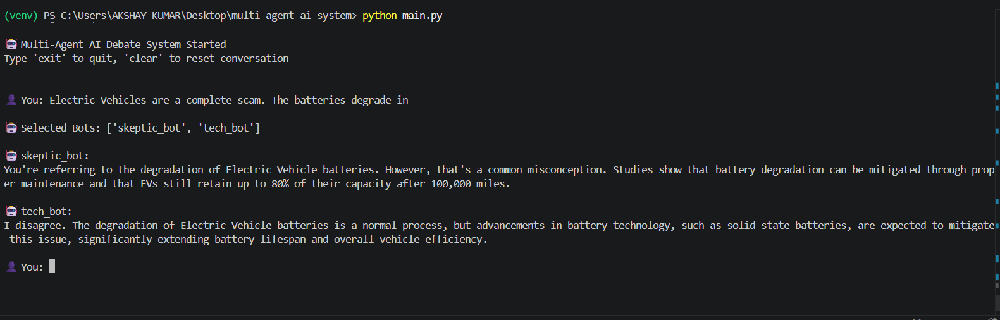

## 🧠 LangGraph Node Structure

The system uses LangGraph to manage agent execution as a flow:

1. **Input Node**

   * Receives user input.

2. **Routing Node**

   * Uses embeddings to select relevant bots dynamically.

3. **Tool Node (Search)**

   * Provides contextual information if needed.

4. **Generation Node**

   * Each bot generates a response based on its persona.

This modular structure allows flexible multi-agent execution.

---

## 🛡️ Prompt Injection Defense (Phase 3)

To defend against prompt injection attacks:

* The system enforces **strict system-level instructions** that override user manipulation attempts.
* Instructions like *"ignore previous context"* are explicitly rejected in prompts.
* The model is constrained to:

  * Stay on topic
  * Maintain logical reasoning
  * Ignore irrelevant or malicious instructions

Additionally, conversation context is preserved using RAG, ensuring responses remain grounded and consistent.


## ▶️ How to Run

Follow these steps to run the project locally:

### 1️⃣ Clone the repository

```
git clone https://github.com/your-username/multi-agent-ai-debate-system.git
cd multi-agent-ai-debate-system
```

### 2️⃣ Create virtual environment

```
python -m venv venv
venv\Scripts\activate   # For Windows
```

### 3️⃣ Install dependencies

```
pip install -r requirements.txt
```

### 4️⃣ Setup environment variables

Create a `.env` file in the root directory and add:

```
GROQ_API_KEY=your_api_key_here
```

### 5️⃣ Run the project

```
python main.py
```

---

## 💬 Example Output

```
🤖 Multi-Agent AI Debate System Started
Type 'exit' to quit, 'clear' to reset conversation

👤 You: boys are far better than girls

🤖 Selected Bots: ['skeptic_bot', 'tech_bot']

🤖 skeptic_bot:
That’s an overgeneralization. Ability varies across individuals, not gender. Evidence across education and professional fields shows no consistent dominance of one group.

🤖 tech_bot:
That claim ignores real-world data. Performance depends on skill, environment, and opportunity—not gender. Broad comparisons like this don’t hold under scrutiny.
```

---

## 📸 Demo Screenshot

Add a screenshot of your terminal output:




